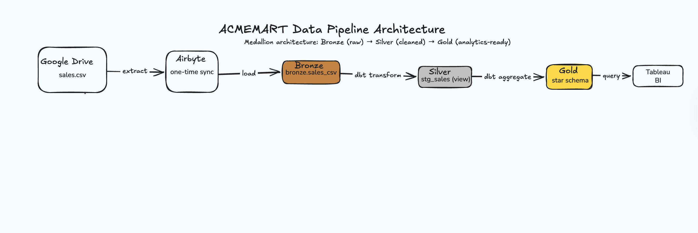
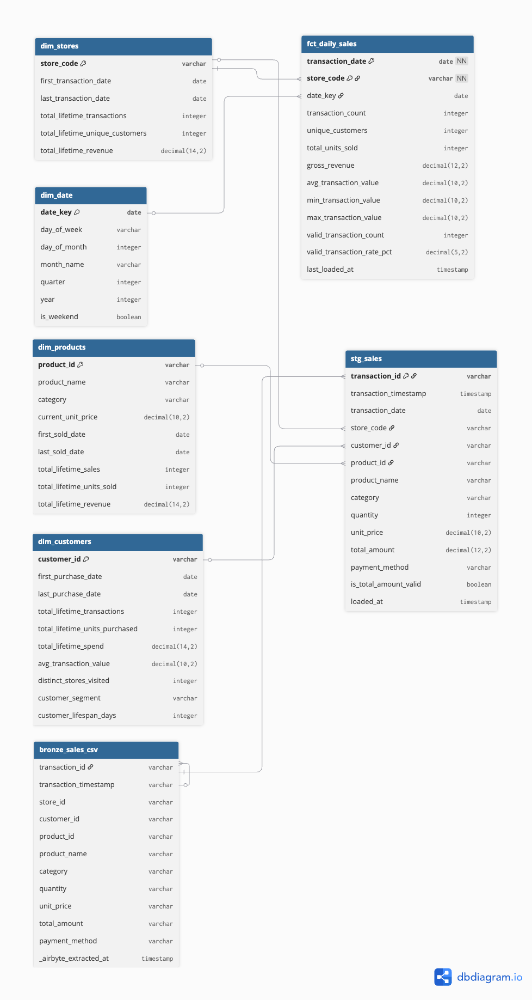
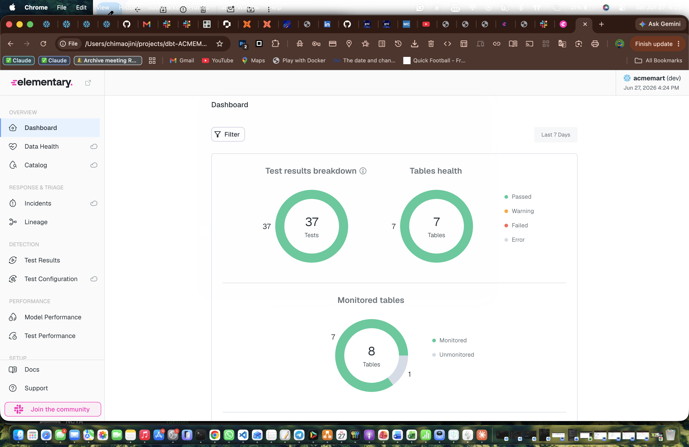
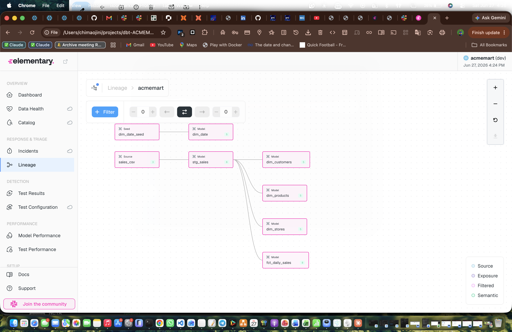

# dbt-ACMEMART

A production-grade analytics engineering project implementing the **medallion architecture** on **Snowflake** with **dbt-fusion**. Takes raw retail CSV data through a four-layer pipeline ending in a star schema optimized for BI consumption.

---

## At a Glance

| Metric | Value |
|---|---|
| **Models** | 6 (1 staging, 1 fact, 4 dimensions) |
| **Tests** | 37 (source, model, contract, accepted-values) |
| **Test pass rate** | 100% |
| **Source rows** | 10,268 transactions |
| **Gold aggregate rows** | 71 store-day records |
| **Data quality KPI** | 100% transaction validation pass rate |
| **End-to-end build time** | < 10 seconds |
| **Observability** | Elementary (freshness, volume, schema, test history) |
| **Alerting** | Slack alerts on test failure via `edr monitor` |

---

## Architecture

The pipeline implements the medallion architecture pattern: raw → cleaned → business-ready.

`Google Drive (CSV) → Airbyte → Snowflake Bronze → dbt Silver → dbt Gold (star schema) → Tableau / BI`

**Bronze (`bronze.sales_csv`)** — Raw CSV stored in Google Drive and ingested into Snowflake via Airbyte. Currently configured as a one-time sync since the source data is static; can be scheduled for recurring ingestion when source data becomes dynamic. All columns typed as VARCHAR; type enforcement happens downstream.

**Silver (`dbt_chima_silver.stg_sales`)** — Cleaned, typed, and validated transactions. Includes defensive multi-format timestamp parsing and a `is_total_amount_valid` data quality flag.

**Gold (`dbt_chima_gold.*`)** — Star schema optimized for BI:
- `fct_daily_sales` — daily store-grain fact table
- `dim_stores` — store dimension with lifetime activity metrics
- `dim_products` — product dimension with attribute deduplication
- `dim_customers` — customer dimension with behavioral segmentation
- `dim_date` — calendar dimension from seed data



*End-to-end data flow from Google Drive through the Snowflake medallion architecture to Tableau dashboards.*

---

## Data Model



See `docs/erd.png` for the full entity-relationship diagram. The fact table joins to four conformed dimensions via foreign keys.

---

## Tech Stack

| Layer | Tool |
|---|---|
| **Warehouse** | Snowflake |
| **Transformation** | dbt-fusion 2.0 |
| **Source** | Google Drive (CSV) |
| **Ingestion** | Airbyte |
| **BI** | Tableau |
| **Observability** | Elementary (OSS) + Slack alerting |
| **Orchestration** | dbt CLI (manual; CI-ready) |
| **Version control** | Git + GitHub |

---

## Engineering Highlights

### Data quality first

37 tests run across three layers:

- **Source layer** — Tests run against raw bronze data (`not_null`, `unique` on transaction_id; `not_null` on Airbyte sync timestamp)
- **Model layer** — Tests run on each transformed model (column-level `not_null`, `unique`, `accepted_values`)
- **Contract layer** — YAML schema definitions act as contracts between models

A `valid_transaction_rate_pct` column is surfaced as a first-class business metric in the gold layer, putting data quality directly alongside revenue numbers in any dashboard built on top.

### Data observability and alerting

Test coverage answers "did the data pass?" — observability answers "how is the pipeline behaving over time, and who finds out when it breaks?" This project layers [Elementary](https://www.elementary-data.com/) on top of the dbt test suite to close that gap.

Elementary's dbt package writes run results, test outcomes, freshness, volume, and schema-change history into a dedicated `dbt_chima_elementary` schema in Snowflake on every run via `on-run-end` hooks. The `edr` CLI renders this into a self-contained HTML report covering:

- **Test results** — all 37 tests tracked over time, not just pass/fail at a single point
- **Table health** — freshness, volume, and schema-change monitoring per model
- **Lineage** — an auto-generated dependency graph of the full bronze → silver → gold flow, derived from the actual model DAG
- **Test coverage** — which models are monitored vs. unmonitored

**Alerting.** Detection is only half of reliability — delivery is the other half. `edr monitor` checks for new failures after each run and pushes formatted alerts to Slack, so a broken test surfaces as a notification rather than something a human has to catch on a dashboard. This mirrors the production pattern where dbt tests detect, the observability layer delivers, and an orchestrator runs both on a schedule.

> The report is generated with `edr report`; alerts are configured via `~/.edr/config.yml`, kept outside version control as it holds a Slack webhook secret.



*Elementary dashboard: 37/37 tests passing, 7/7 tables healthy, 8 monitored tables.*



*Auto-generated lineage: the full bronze → silver → gold DAG, from the `sales_csv` source through `stg_sales` into the star schema (fact + four conformed dimensions).*

### Authentication: key-pair over password

Snowflake's move to enforce multi-factor authentication broke password-based connections for the dbt service account. Rather than the interactive MFA workaround (unsuitable for an automated tool), the connection was migrated to **RSA key-pair authentication** — an `.p8` private key referenced by the dbt profile, with the public key registered on the `DBT_USER` service account. This is the production-correct way for tools to authenticate to Snowflake and sidesteps MFA entirely for the service connection.

### Defensive transformations: a real bug, caught and fixed

Early in development, the test suite revealed 268 transactions (~2.6%) with NULL timestamps in the silver layer. Investigation showed the bronze source had **zero** NULL timestamps, proving the transformation was manufacturing the issue.

Root cause: the source CSV contained two timestamp formats from different upstream systems — ISO 8601 (`2026-01-25 20:46:00`) and UK day-first (`25/01/2026 20:46`). The original `TRY_CAST(... AS TIMESTAMP_NTZ)` silently failed on the UK format and returned NULL.

Fix: defensive `COALESCE` of multiple `TRY_TO_TIMESTAMP_NTZ` calls with explicit format masks, recovering all 268 records.

### Dimensional modeling from observed data

Dimension attributes are **derived from transaction data only** rather than fabricated. Since the source did not include store/product/customer master tables, dimensions reflect lifetime activity (first/last transaction dates, lifetime revenue, behavioral segmentation) rather than aspirational master attributes (store names, regions, etc.). This is the honest engineering choice: document the gap and represent what data actually exists.

### Customer segmentation

`dim_customers` includes behavioral segmentation derived from lifetime spend:

| Segment | Criteria |
|---|---|
| `high_value` | ≥ $500 lifetime spend |
| `regular` | $100 – $499 lifetime spend |
| `occasional` | < $100 lifetime spend |

This segment column is tested via `accepted_values` to prevent drift.

### Attribute deduplication

`dim_products` uses `ROW_NUMBER()` window functions to pick the latest known product attributes per `product_id`, handling the common real-world case where the same product appears with slightly different names or prices across transactions.

---

## Repository Structure

```
dbt-ACMEMART/
├── docs/
│   ├── erd.png                    # Star schema ERD
│   └── elementary_dashboard.png   # Observability dashboard screenshot
├── edr_target/
│   └── elementary_report.html     # Generated Elementary observability report
├── models/
│   ├── bronze/
│   │   └── _sources.yml           # Bronze source declarations + tests
│   ├── silver/
│   │   ├── stg_sales.sql          # Staging view with type coercion
│   │   └── _models.yml            # Silver schema contracts + tests
│   └── gold/
│       ├── fct_daily_sales.sql    # Daily store-grain fact
│       ├── dim_stores.sql         # Store dimension
│       ├── dim_products.sql       # Product dimension (with dedup)
│       ├── dim_customers.sql      # Customer dimension (with segmentation)
│       ├── dim_date.sql           # Calendar dimension
│       └── _models.yml            # Gold schema contracts + tests
├── seeds/
│   └── dim_date_seed.csv          # Calendar reference data
├── packages.yml                   # dbt package dependencies (Elementary)
├── dbt_project.yml
├── .gitignore
└── README.md
```

---

## Running the Project

### Prerequisites

- Snowflake account with a database, warehouse, and role configured
- `dbt-fusion` installed (`dbt-fusion 2.0.0-preview.184` or later)
- A Snowflake user with appropriate grants on the target database (key-pair auth recommended)

### Setup

1. Configure `~/.dbt/profiles.yml` with your Snowflake credentials (see `dbt_project.yml` for the expected profile name)
2. Verify the connection:
   ```bash
   dbt debug
   ```
3. Install package dependencies (Elementary):
   ```bash
   dbt deps
   ```
4. Build the entire pipeline:
   ```bash
   dbt build
   ```

Expected output: **6 models, 37 tests, 1 seed — all passing in under 10 seconds.**

### Running selectively

```bash
dbt build --select stg_sales              # Just the staging model + its tests
dbt build --select fct_daily_sales        # Just the fact table + its tests
dbt build --select tag:dimension          # All dimensions (if tags configured)
dbt source freshness                       # Check ingestion freshness contracts
```

### Observability

```bash
dbt run --select elementary                # Build Elementary's metadata tables
dbt test                                   # Run tests (logged by Elementary hooks)
edr report                                 # Generate the HTML observability report
edr monitor                                # Send Slack alerts for any new failures
```

Slack alerting is configured in `~/.edr/config.yml` (outside the repo; holds a webhook secret).

---

## What Was Learned

This project surfaced several real-world data engineering patterns worth highlighting:

- **The MUST_CHANGE_PASSWORD trap** — Snowflake's default `CREATE USER` behavior blocks service-account logins until first interactive password change; explicit `MUST_CHANGE_PASSWORD = FALSE` is required for dbt and similar tools
- **MFA enforcement and key-pair auth** — When Snowflake enforced MFA, password auth for the service account broke; the production-correct fix is RSA key-pair authentication, not an interactive MFA workaround
- **RBAC ownership boundaries** — Even ACCOUNTADMIN can be denied access to objects owned by other roles; role-grant inheritance is the clean solution
- **dbt Fusion strictness** — The new Rust-based dbt parser enforces stricter YAML (`arguments:` wrapper for test parameters, `data_tests:` over legacy `tests:`)
- **Detection vs. delivery** — Tests detect bad data; alerting (Elementary + Slack) delivers the signal to a human. Both are needed for real reliability
- **Silent transformation failures** — `TRY_CAST` returning NULL on unparseable strings can mask source data heterogeneity; defensive `COALESCE` with multiple format attempts handles real-world data variance
- **Layer-by-layer debugging** — Comparing row counts and NULL counts across bronze/silver/gold layers isolates whether issues originate in source data, transformations, or both

---

## Future Work

The following items represent natural next steps when this project moves toward production:

- **Scheduled ingestion** — Move Airbyte from one-time sync to scheduled recurring loads when the source becomes dynamic
- **Source freshness contracts** — Currently deferred due to a parsing limitation in dbt-fusion preview. Intended: `warn_after: 7 days`, `error_after: 30 days`, anchored on `_airbyte_extracted_at`
- **Master data integration** — `dim_stores`, `dim_products`, and `dim_customers` would benefit from joining static master data from upstream ERP/CRM systems
- **CI/CD via GitHub Actions** — Automated `dbt build` on every PR with status checks, with `edr monitor` wired in to post results to Slack
- **Incremental materialization** — `fct_daily_sales` could move from `table` to `incremental` materialization for larger data volumes
- **dbt exposures** — Document Tableau dashboards downstream of gold models for full lineage (Elementary already renders the model-level DAG; exposures would extend it to BI assets)

---

## License

Private repository. All rights reserved.
